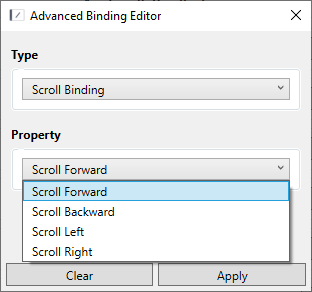
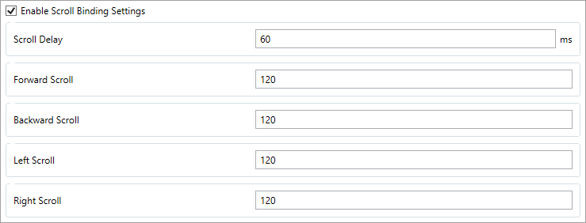

# Scroll Bindings

This plugin provide bindings, allowing users to scroll vertically & horizontally.

## How to use

1. Click on the 3 dots next to a binding,
2. Select "Scroll Bindings" as the Type,

    

3. Select Any of the options in Property (And other settings if available),

5. Press Apply.

## How To Change Settings (in 0.6.x)

You can change the settings in the Advanced Binding Editor.

## How To Change Settings (in 0.5.x)

To change speed, you may change the `Scroll delay` in Tools > Scroll Bindings Settings.

    

Do not forget to enable the settings tool, otherwise default values will be used.